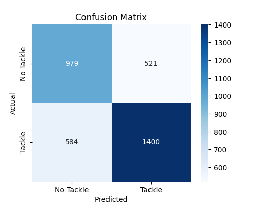
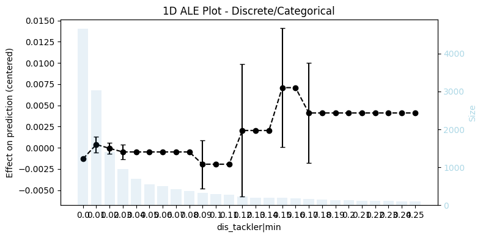

# NFL_BDB_2024
NFL Big Data Bowl 2024 Kaggle Competition


```plaintext
NFL_BDB_2024/
├── data/          # data raw or preprocessed
├── models/
│   └── saved_model_YYYYMMDD_HHMMSS/ # saved model with checkpoints and results
├── notebooks/
│   ├── ALE_ploys.ipynb  # ALE plots model explainability
│   ├── EDA.ipynb 
│   └── tackle_prediction_poc.ipynb # Model proof of concept
├── src/
│   ├── scripts/
│   │    ├── preprocessing.py  # merge input datasets and make dataset for predictions
│   │    ├── feature_engineering.py # add features
│   │    └── train_model.py # train and save model
│   └── prepare_data.py   # data preprocessing and model training pipeline
├── .gitignore
├── requirements.txt
└── README.md
```

## 1. `preprocessing.py`
Prepares and merges football tracking data for analysis.

### **What the Script Does**
- Standardizes play direction.  
- Merges **games, plays, players, tackles, and tracking data**.  
- Identifies **who tackled whom**.  
- Labels plays with `"tackle"`, `"missed tackle"`, etc.  
- Saves the processed data as a CSV file.  

---

## 2. `feature_engineering.py`
Creates features for training a machine learning model.

### **What the Script Does**
- Aggregates tracking data per tackler.  
- Computes movement stats and speed differences.  
- Defines **tackle success** as the target variable.  
- Applies **one-hot encoding** to categorical features.  
- Saves the final dataset as `train_data.csv`.

## 3. **Modeling Results**
The model was trained using **XGBoost** with Grid Search
 ### **Test F1 Score**: **0.7170**




## 4. ALE Plots

Accumulated Local Effects (ALE) plots help us gain better insights into the model's behavior by analyzing feature influences and interactions. This aligns with the competition's goal of improving interpretability. 

### Why Use ALE Plots?
- **Feature Influence**: Understand how individual features impact model predictions.
- **Feature Interactions**: Identify relationships between features and their combined effects.
- **Model Interpretability**: Enhance transparency and trust in the model.

By leveraging ALE plots, we can provide more meaningful insights and ensure the model is both accurate and interpretable.
.



# NOTE
This project is a **basic version** due to time constraints and can be improved in **many ways**—including feature selection, model tuning, and interpretability. Future versions can provide better insights and performance.
